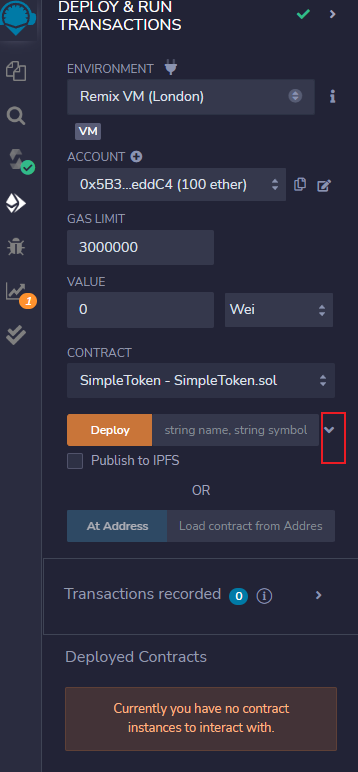

# ERC20代币

两种代币实现：

1. SimpleToken：简单erc20代币

2. ERC20Spendable：支持增发、燃烧的代币

## 部署教程

1. 打开 https://remix.ethereum.org/ 在线合约开发平台

2. 新增一个工作目录

3. 打开本地目录的erc合约文件

5. 编译文件

7. 部署合约
   1. 展开部署合约参数
   2. 填写代币名称、简称、个数
   3. 选择部署环境（截图是使用metamask部署，选了goerli测试环境）
   4. 点击transact进行部署

8. 查看部署合约，等待几秒钟后，可以在左下角看到deployed contract

