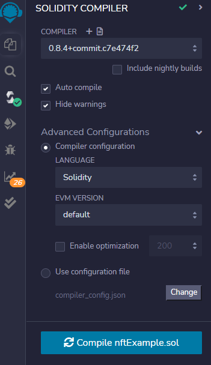
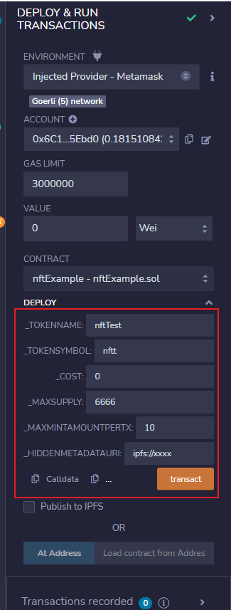

# NFT合约

## 准备

nft制作

1. 参考opensea的metadata格式，创建nft的图片，并为每个图片绑定metadata信息
2. 把nft打包上传到ipfs，可以借助 https://nft.storage/ 平台上传

## 部署

1. 编译
   1. compile version：8.4
   2. evm version：default

2. 部署
   1. 部署参数
      1. token名称
      2. token简称
      3. mint的价格
      4. 一个账号最大能mint多少个
      5. nft存储地址：一般为ipfs

